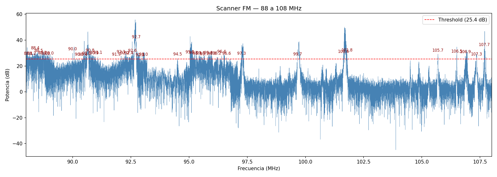
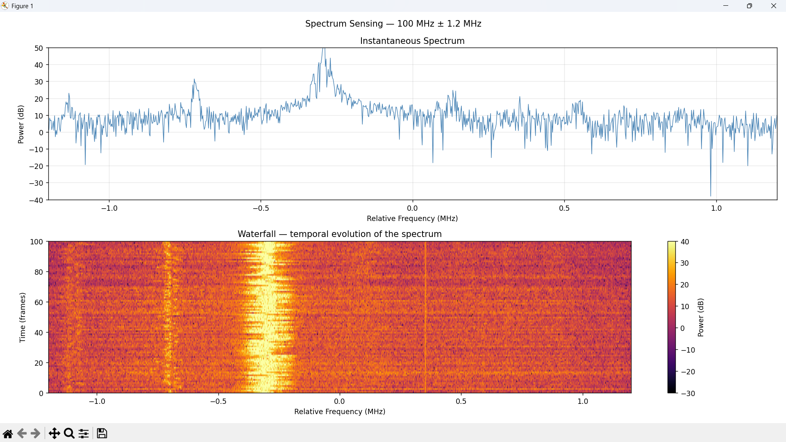
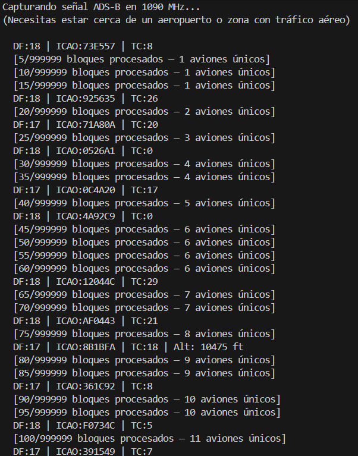
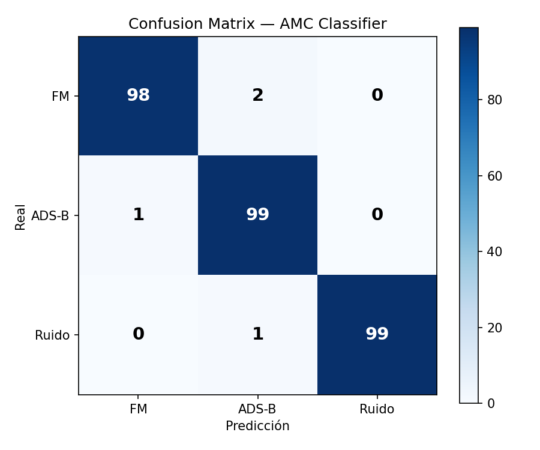
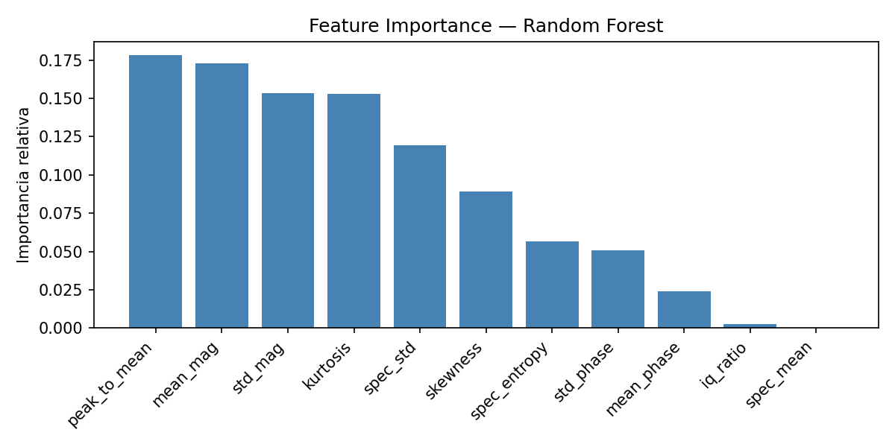

# RTL-SDR Projects

Signal processing projects using a low-cost RTL-SDR dongle and Python. Built from scratch as part of my preparation to contribute to wireless systems research.

**Hardware:** RTL-SDR Blog V3 dongle + dipole antenna  
**Stack:** Python 3.11 · pyrtlsdr · NumPy · SciPy · scikit-learn · Matplotlib

---

## Projects

### 1. FM Spectrum Scanner
Sweeps the full FM band (88–108 MHz) by capturing IQ samples at 2 MHz steps, computing the power spectral density via FFT, and automatically detecting active stations above a dynamic threshold.

**Key concepts:** IQ sampling · FFT · PSD · threshold detection



---

### 2. Real-Time Spectrum Sensing + Waterfall
Continuously captures IQ samples and renders a live dual-panel display: instantaneous spectrum on top, time-frequency waterfall below. Each row of the waterfall is one FFT frame — persistent signals appear as vertical bands.

**Key concepts:** Spectrum sensing · time-frequency analysis · real-time DSP



---

### 3. ADS-B Decoder from Scratch
Receives Mode S ADS-B transmissions at 1090 MHz without any external decoding library. The pipeline:
1. Demodulate IQ samples to AM envelope
2. Detect the ADS-B preamble pattern (pulses at 0, 2, 7, 9 µs)
3. Extract 112 bits via Manchester decoding
4. Parse Downlink Format, ICAO address, altitude, and callsign fields

Detected **71 unique aircraft** in a single session over Tijuana/San Diego airspace.

**Key concepts:** OOK demodulation · Manchester decoding · binary protocol parsing



---

### 4. Automatic Modulation Classifier (AMC)
Trains a Random Forest classifier to distinguish FM broadcast, ADS-B, and noise from raw IQ samples — no labels at inference time.

**Feature extraction** (per 1024-sample capture):
- Time domain: mean magnitude, std, kurtosis, skewness
- Phase domain: mean and std of unwrapped phase derivative
- Frequency domain: spectral entropy, spectral std, peak-to-mean ratio

**Results:** 99% accuracy on held-out test set (300 samples, 3 classes)




---

## Setup

```bash
# Create environment with Python 3.11
uv venv sdr-env --python 3.11
source sdr-env/bin/activate  # or: sdr-env\Scripts\Activate.ps1 on Windows

# Install dependencies
uv pip install pyrtlsdr numpy scipy matplotlib scikit-learn joblib
```

Install WinUSB driver via [Zadig](https://zadig.akeo.ie) (Windows only).

---

## Background

These projects were built to develop hands-on experience with SDR and wireless signal processing, with focus on spectrum sensing and real-time signal classification.